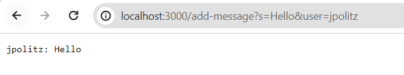
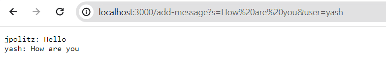
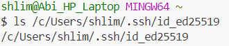
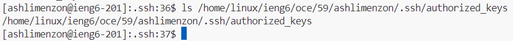
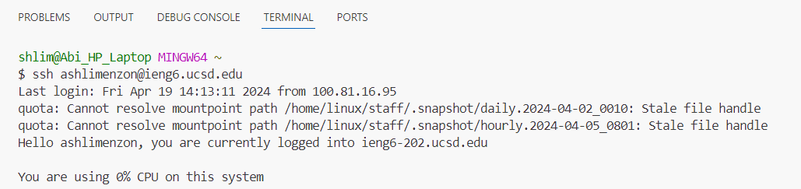

# Part 1:
```
import java.io.IOException;
import java.net.URI;

class Handler implements URLHandler{
    String str = "";

    public String handleRequest(URI url) {
        if (url.getPath().equals("/add-message")) {
            String[] parameters = url.getQuery().split("&");

            String[] userParam = parameters[1].split("=");
            String[] messageParam = parameters[0].split("=");
            String user = userParam[1];
            String message = messageParam[1];
            str += String.format("%s: %s\n", user, message);
            return str;
        }
        return "404 Not Found!";
    }
}

class ChatServer {
    public static void main(String[] args) throws IOException {
        if(args.length == 0){
            System.out.println("Missing port number! Try any number between 1024 to 49151");
            return;
        }

        int port = Integer.parseInt(args[0]);

        Server.start(port, new Handler());
    }
}
```


- **Methods Called:** The handleRequest method is called.
- **Relevant Arguments/ Values of Relevant Fields:** The relevant argument is the `url` that is then taken in as a parameter. `str` is initially an empty string field in the `Handler` class.
- **Values Change:** When I add the request `/add-message?s=Hello&user=jpolitz` the `str` field is changed. The value passed in for user and message is added to `str` with a new line following them. In this case the code starts by seperating the query `s=Hello&user=jpolitz` at the & symbol and storing it in an array of Strings called `parameters`. Then the code further splits the two Strings stored in parameters at the = symbol. It stores the 1 index of `parameters` split at = in the String array `userParam` and the 0 index in the String array `messageParam`. Then String `user` gets the value of `userParam` at index 1 and the String `message` gets the value of `messageParam` at index 1. These two strings store only the user and message value that is needed to be returned. Finally, the string containing `user` and `message` is added to `str.` Updating and then returning the new value of str.



- **Methods Called:** The handleRequest method is called.
- **Relevant Arguments/ Values of Relevant Fields:** The relevant argument is the `url` that is then taken in as a parameter. `str` is a string containing "jpolitz: Hello".
- **Values Change:** When I add the request `/add-message?s=How are you&user=yash` the `str` field is again updated. The code goes through the same steps as it did for the previous request. However this time the `str` field adds on to the already existing String "jpolitz:hello\n" making str "jpolitz: hello\nyash: How are you". This then appears on the screen as two seperate lines, because \n is a new line character which is an escape sequence that makes the rest of the string be printed on the next line on the screen.

  # Part 2:
  **Private Key:**
  
  
  
  **Public Key:**
  
  
  
  **Login:**
  
  

  # Part 3:
  In the week 2 lab I learned how to set up and run a web server locally and remotely. In the week 3 lab I learned how to create and use SSH key-based authentication to allow me to access a remote server much quicker as the key authenticates my local computer allowing me to login without a password.
  
