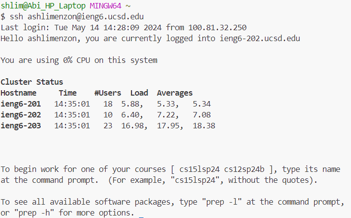
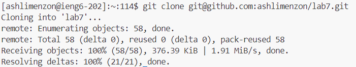
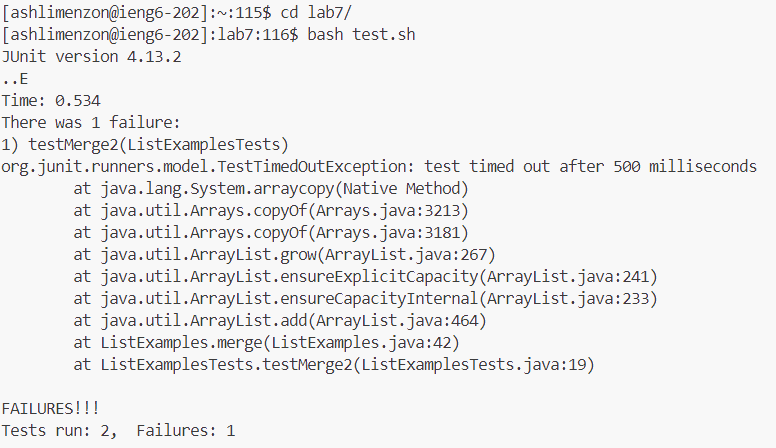
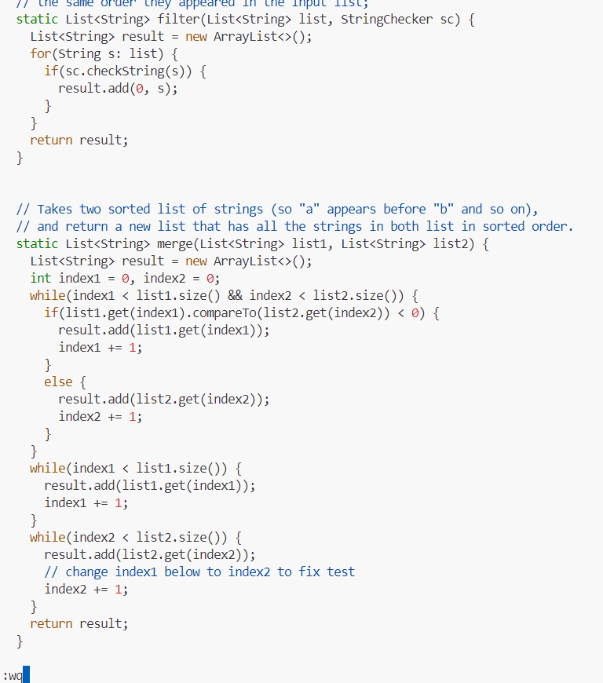
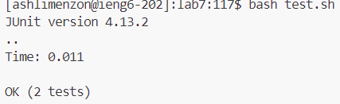
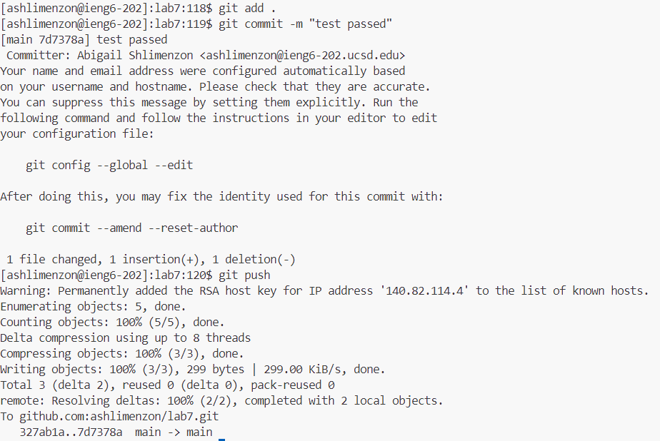

* **Step 4:**
  * **Keys pressed:** `ssh<space>ashlimenzon@ieng6.ucsd.edu<enter>` I used the `ssh` command with `ashlimenzon@ieng6.ucsd.edu` as the argument to login to my ieng6 account.
  * **Image:** 
* **Step 5:**
  * **Keys pressed:** `git<space>clone<space><Ctrl-V><enter>` I used the `git` command with the two arguments: `clone` and I used `<Ctrl-V>` to get the SSH URL: `git@github.com:ashlimenzon/lab7.git`(because I copied it from my github account using <Ctrl-C>) so that the fork of the repository on my Github account would be cloned in my ieng6 account.
  * **Image:** 
* **Step 6:** 
  * **Keys pressed:** `cd<space>lab7/<enter>` and `bash<space>test.sh<enter>` I used the `cd` command with the argument `lab7/` to change directories from the main directory to lab7. I then ran the tests using the `bash` command with the argument `test.sh` which ran `test.sh` which is a bashscript and outputted in terminal the tests that were passing and failing.
  * **Image:** 
* **Step 7:**
  * **Keys pressed:** `vim<space>ListExamples.java<enter>, :44, e, dw, i, 2 <space>, <escape>, :wq` I used the `vim` command with the argument `ListExamples.java` in order to open the ListExamples file with vim editor. I then typed `:44` to go to the 44th line in the file which was where the error was located. I then typed `e` to go to the end of the first word on the line I was on. I then typed `dw` to delete the 1 that was where my cursor was and also the end of the first word. I then typed `i` to enter editor mode. I then typed `2` and `<space>` in order to make it so that index2 was being updated instead of index1. I then pressed escape to leave editor mode. Then I typed `:wq` to exit the vim editor and save the changes I had made.
  * **Image:** 
* **Step 8:**
  * **Keys pressed:** `bash<space>test.sh<enter>` I again ran the tests using the `bash` command with the argument `test.sh` which ran `test.sh` which is a bashscript. This outputted the results of running the tests in terminal and showed that all the tests were passing.
  * **Image:** 
* **Step 9:**
  * **Keys pressed:** `git<space>add<space>.<enter>` , `git<space>commit<space>-m<space>"tests passed"<enter>` , `git<space>push<enter>` I used the `git` command with the arguments `add` and `.` in order to add all the changes that were made in the current directory and its subdirectories to the staging area. I then used the `git` command with the argument `commit` and the option `-m "tests passed"` to commit the changes made to the repository with a message describing the changes that were made. Finally, I used the `git` command with the argument `push` to upload the content from the local repo on my ieng6 account to the remote repo in my Github account.
  * **Image:** 
