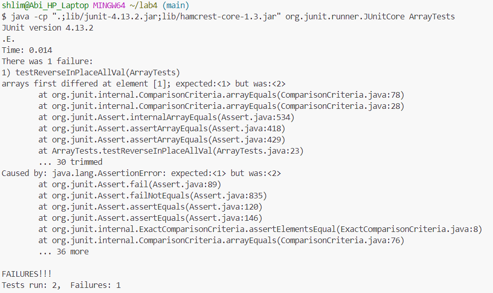

# Part 1: Bugs
1. failure inducing input
```
   @Test
   public void testReverseInPlaceAllVal(){
   int[] input = {1,2};
   ArrayExamples.reverseInPlace(input);
   assertArrayEquals(new int[] {2,1}, input);
   }
```
   
2. input that doesnt induce failure
```
   @Test 
	public void testReverseInPlaceOneVal() {
    int[] input1 = { 3 };
    ArrayExamples.reverseInPlace(input1);
    assertArrayEquals(new int[]{ 3 }, input1);
	}
```
3. output of running tests:

  
5. bug before:
```
  static void reverseInPlace(int[] arr) {
    for(int i = 0; i < arr.length; i += 1) {
      arr[i] = arr[arr.length - i - 1];
    }
  }
```
  bug after:
```
  static void reverseInPlace(int[] arr) {
      for(int i = 0; i < arr.length / 2; i += 1) {
        int num = arr[i];
        arr[i] = arr[arr.length - i - 1];
        arr[arr.length - i -1] = num;
      }
    }
```

5. Description: The issue with the method was that the first half of the array doesn't get stored anywhere and instead gets replaced by the second half. To fix this you have to iterrate through only half the array and create a temporary value to store the first half so that the values flip rather than just being overwritten.

# Part 2: Researching Commands
**1.** The `-i` option for `grep` makes the search case insentive. This is useful for when you want to search through a file but the case doesn't matter. Source: I used grep --help in bash to find a list of command line options.
```
shlim@Abi_HP_Laptop MINGW64 ~/docsearch/technical/biomed (main)
$ grep -i rna rr74.txt
        hypoxia from birth and measured NOS mRNA and protein
          protein and RNA measurement, and the left lung was fixed
          Total RNA was extracted from 100 mg of frozen lung
          2 O. RNA was quantified and samples
          Biosystems, Foster City, CA, USA). RNA quantity was
          determined using 18 S rRNA primers/probes (Applied
          RNA.
        The increase in eNOS protein and mRNA levels, and the
        both iNOS mRNA and protein levels in rat lungs following
        iNOS mRNA levels was not associated with detectable iNOS
        in vivo downregulation of eNOS mRNA
```
In the first example `grep -i` looks through the file `rr74.txt` for instances of `rna` ignoring the case of the letters and then prints out the lines containing that pattern. This is useful in this case because if I just did `grep` and put the pattern `rna` their would be no instances found since `rna` is capitalized throughout the document but since I added the `-i` option it located the instances of `RNA` and any other capitalizations of `rna` as well.
```
shlim@Abi_HP_Laptop MINGW64 ~/docsearch/technical/biomed (main)
$ grep -i ph cc2172.txt
        ARDS, as assessed by measurement of gastric mucosal pH (pH 
          inserted into the stomach to measure pH
          catheter was confirmed by radiography. Enteral nutrition
          allow for equilibration, pH
          the equilibration time [ 12 ] . The pH
          and gastric pH
        Physiology and Chronic Health Evaluation II score was 19.7
        of PEEP. The mean pH
        P = 0.84). Similar to pH
        as a whole, changes in pH
        individual patients (Table 3). The pH
        baseline . The pH
        in pHi did not increase. Rather, DO
        patients who exhibited a drop in pH
        change in pH
        studies. Gastric pH
        variations in pH
        differences in pH
        Because of concerns about the reliability of pH
        better parameter than pH
        i [ 16 ] . The pH
        unlike pH
        correlated with changes in pH
        i . Consequently, we used pHi values in
        our discussion because we believe that pH
        pH in patients.
        ] , we found no change either in pH
        impact on pH
        monitoring pH
        nutrition [ 19 ] , rendering it possible to use gastric pH
        Finally, pH
        significantly change pH
        end-expiratory pressure; pH
        i = gastric mucosal pH.
```
In the second example `grep -i` looks through the file `cc2172.txt` for instances of `ph` ignoring the case of the letters and then prints out the lines containing that pattern. This is useful in this case because if I just did `grep` and put the pattern `ph` their would be very few instances found since `ph` is very rarely fully uncapitalized throughout the documents and would only return the result of the pattern found in the middle of words, however since I wanted all of the instances of `ph`, including when it is it's own word or is located at the beginning of the word, using the `-i` command allowed me to find all instances where `ph` is differently capitalized as well such as `pH` and `Ph`.\
\
\
**2.** The `-w` option for grep makes sure that the pattern only matches whole words and not parts of a word. This is helpful if a pattern you are looking for is commonly found in other words but you only want the pattern when its by itself. Source: I used grep --help in bash to find a list of command line options.
```
shlim@Abi_HP_Laptop MINGW64 ~/docsearch/technical/biomed (main)
$ grep -w RNA rr74.txt
          protein and RNA measurement, and the left lung was fixed
          Total RNA was extracted from 100 mg of frozen lung
          2 O. RNA was quantified and samples
          Biosystems, Foster City, CA, USA). RNA quantity was
          RNA.
```
In the first example `grep -w` looks through the file `rr74.txt` for instances of `RNA` only as a whole word. This is useful in this case because if I just did `grep` and put the pattern `RNA` it would find instances such as `mRNA` or `rRNA` but if I only wanted to find where there were instances of just `RNA` by adding `-w` it does not include the instances of `RNA` when it is present in another word and therefore only gives me lines where `RNA` is on its own. 
```
shlim@Abi_HP_Laptop MINGW64 ~/docsearch/technical/biomed (main)
$ grep -w i cc2172.txt
        i ).
          therapeutic intervention to improve haemodynamics (i.e.
          i . Correct placement of the TRIP
          i was measured 45 min after injection
          i was calculated using the
          i , were taken at baseline and
        i was 7.31 ± 0.13 at baseline and 7.32 ±
        i , alterations in the gap between
        i and P
        i decreased in eight patients (47%), it
        i at PEEP
        i .
        i at PEEP
        i , and consequently splanchnic blood
        i in response to PEEP. Although
        i response among individuals cannot
        splanchnic vascular response (i.e. severity and/or duration
        i for assessing mucosal perfusion, we
        i [ 16 ] . The pH
        i level can sometimes be misleading,
        i , which can change with the degree of
        both components (i.e. partial arterial and tissue carbon
        i . Consequently, we used pHi values in
        i reliably reflects the accurate tissue
        i or P
        i , as described under Method (see
        i using gastric tonometry. Although the
        i to evaluate splanchnic perfusion.
        i was measured after patients had been
        i , it is conceivable that longer
        i = gastric mucosal pH.
```
In the second example `grep -w` looks through the file `cc2172.txt` for instances of `i` only as a whole word. This is useful in this case because if I just did `grep` and put the pattern `i` it would find atleast hundreds of instances as `i` is present in many words, examples including `in`, `differences`, `patients` so I would get many irrelivant lines that I would not need, but if I only wanted to find where there were instances of just `i` on its own by adding `-w` it does not include the instances of `i` when it is present in another word and therefore only gives me lines where `i` is on its own, giving me the results I want.\
\
\
**3.** The `-n` option for grep displays the line number in front of the matching lines that contain the pattern. This can be useful if line number is needed. Source: I used grep --help in bash to find a list of command line options.
```
shlim@Abi_HP_Laptop MINGW64 ~/docsearch/technical/biomed (main)
$ grep -n RNA rr74.txt
40:        hypoxia from birth and measured NOS mRNA and protein
73:          protein and RNA measurement, and the left lung was fixed
114:          Total RNA was extracted from 100 mg of frozen lung
118:          2 O. RNA was quantified and samples
125:          Biosystems, Foster City, CA, USA). RNA quantity was
126:          determined using 18 S rRNA primers/probes (Applied
131:          RNA.
258:        The increase in eNOS protein and mRNA levels, and the
294:        both iNOS mRNA and protein levels in rat lungs following
296:        iNOS mRNA levels was not associated with detectable iNOS
355:        in vivo downregulation of eNOS mRNA
```
In the first example `grep -n` looks through the file `rr74.txt` for instances of `RNA` and displays the lines containing the instances and the line number . This is useful in this case because if I just did `grep` and put the pattern `RNA` it would only display the lines containing the string but if I wanted to then locate that line in the file it would be very hard because I would have to manually go line by line and see if the line matches the printed out line, however by giving me the line numbers I can now easily locate the lines containing `RNA` in the file.
```
shlim@Abi_HP_Laptop MINGW64 ~/docsearch/technical/biomed (main)
$ grep -n pH cc2172.txt
52:        ARDS, as assessed by measurement of gastric mucosal pH (pH 
114:          inserted into the stomach to measure pH
119:          allow for equilibration, pH
127:          the equilibration time [ 12 ] . The pH
132:          and gastric pH
201:        of PEEP. The mean pH
208:        P = 0.84). Similar to pH
215:        as a whole, changes in pH
219:        individual patients (Table 3). The pH
224:        baseline . The pH
244:        in pHi did not increase. Rather, DO
249:        patients who exhibited a drop in pH
281:        change in pH
299:        studies. Gastric pH
313:        variations in pH
315:        differences in pH
325:        Because of concerns about the reliability of pH
330:        better parameter than pH
331:        i [ 16 ] . The pH
335:        unlike pH
347:        correlated with changes in pH
348:        i . Consequently, we used pHi values in
349:        our discussion because we believe that pH
351:        pH in patients.
355:        ] , we found no change either in pH 
372:        impact on pH
381:        monitoring pH
389:        nutrition [ 19 ] , rendering it possible to use gastric pH
399:        Finally, pH
403:        significantly change pH
441:        end-expiratory pressure; pH
442:        i = gastric mucosal pH.
```
In the second example `grep -n` looks through the file `cc2172.txt` for instances of `pH` and displays the lines containing the instances and the line number. This is useful in this case because if I just did `grep` and put the pattern `pH` it would only display the lines containing the strring but if I wanted to then locate that line in the file it would be very hard because I would have to manually go line by line and see if the line matches the printed out line, however by giving me the line numbers I can now easily locate the lines containing `pH` in the file.\
\
\
4.The `-c` option for grep counts and displays in the terminal the number of times the pattern is found in the file. This can be useful if you want a quick count rather than a display of each line. Source: I used grep --help in bash to find a list of command line options.
```
shlim@Abi_HP_Laptop MINGW64 ~/docsearch/technical/biomed (main)
$ grep -c RNA rr74.txt
11
```
In the first example `grep -c` looks through the file `rr74.txt` for instances of `RNA` and displays the number of lines in the file containing that string. This can be useful if I only need a count of the instances, so rather than manually counting each line that is printed out on the screen, I have the lines already counted for me. This can especially be useful if there are hundred of instances of the pattern because it is very common or the file is very big, because then counting would be very impractical.
```
shlim@Abi_HP_Laptop MINGW64 ~/docsearch/technical/biomed (main)
$ grep -c pH cc2172.txt
32
```
In the second example `grep -c` looks through the file `cc2172.txt` for instances of `pH` and displays the number of lines in the file containing that string. This can be useful if I only need a count of the instances, so rather than manually counting each line that is printed out on the screen, I have the lines already counted for me. This can especially be useful if there are hundred of instances of the pattern because it is very common or the file is very big, because then counting would be very impractical.
