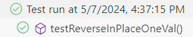

# Part 1: Bugs
1. failure inducing input
```
   @Test
   public void testReverseInPlaceAllVal(){
   int[] input = {1,2};
   ArrayExamples.reverseInPlace(input);
   assertArrayEquals(new int[] {2,1}, input);
   }
```
   
2. input that doesnt induce failure
```
   @Test 
	public void testReverseInPlaceOneVal() {
    int[] input1 = { 3 };
    ArrayExamples.reverseInPlace(input1);
    assertArrayEquals(new int[]{ 3 }, input1);
	}
```
3. output of running tests

  


5. bug before:
```
  static void reverseInPlace(int[] arr) {
    for(int i = 0; i < arr.length; i += 1) {
      arr[i] = arr[arr.length - i - 1];
    }
  }
```
  bug after:
```
  static void reverseInPlace(int[] arr) {
      for(int i = 0; i < arr.length / 2; i += 1) {
        int num = arr[i];
        arr[i] = arr[arr.length - i - 1];
        arr[arr.length - i -1] = num;
      }
    }
```
4. 
